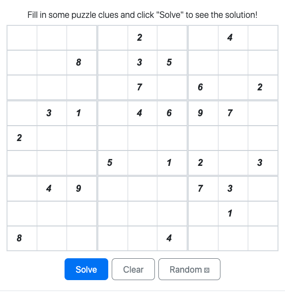
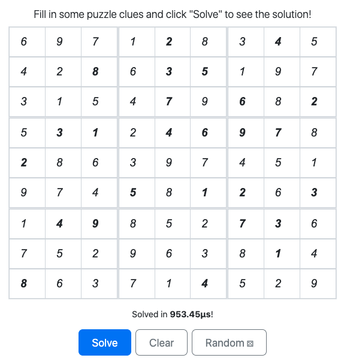
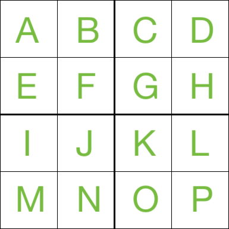
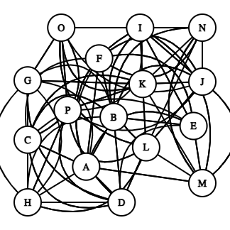
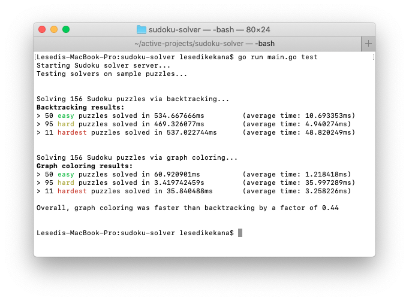

# sudoku-solver

A very fast Sudoku solver written in Go, with a web interface in React to allow users to input their own puzzles and see the solution.

<div style="display: flex; justify-content: center; gap: 10px;">
  
  
</div>

> And yes, that does say "Solved in 953.45µs" (microseconds)

## Background

Initially created as a fun project to try and solve Sudoku puzzles using only strategies I learnt from playing the game.

Unfortunately my knowledge at the time was only a few steps above brute forcing the puzzle, but it worked well for easy to medium difficulty puzzles.

After progressing through university and learning more about computer science, I realised that I could approach this problem in more efficient ways but, stubbornly, I didn't just want to write a version that was already out there, I wanted to use my own brain and figure out how to solve it myself.

## Solving strategies used

### [Backtracking](https://en.wikipedia.org/wiki/Backtracking)

It begins with [the 8-Queens problem](https://en.wikipedia.org/wiki/Eight_queens_puzzle). This is a problem where you have to place 8 queens on a chessboard such that no two queens threaten each other. This is a classic problem that can be solved using **backtracking**, which is a type of algorithm where you can try out various solutions step-by-step and take steps back (or *backtrack*) when go down a path that doesn't work out.


I realised that this could be applied to Sudoku puzzles, where you can try out different numbers in the empty cells and backtrack when you find a conflict with the rules of Sudoku.

### [Graph Coloring](https://en.wikipedia.org/wiki/Graph_coloring)

I also knew that there definitely was a way to find a solution mathematically and without needing to try out different possibilities, but I didn't know how to do it at the time.

After reducing the 9x9 grid to a smaller 2x2 and assigning a letter to each cell:


then, representing the related cells using a graph:
<div style="display: flex; justify-content: center; gap: 10px;">
  
</div>

This just becomes [a math problem](https://en.wikipedia.org/wiki/Discrete_mathematics). While messy visually, it's rather straightforward for a computer. (Thanks to my DSA class) I realised that by connecting the numbers that are related to one another and limit the available numbers (let's call them neighbours), choosing a number to fill in is just graph coloring.

Essentially, mathematically, the problem to solve would be ensuring that the digits 1-9 were assigned to every cell as long as it wasn't the same number as it's neighbour.

Just like coloring a map where you have to make sure that no two adjacent regions have the same color, you can think of Sudoku as a graph coloring problem where you have to assign a number (color) to each cell (region) such that no two adjacent cells (regions) have the same number (color).


I implemented the [Berlaz algorithm (DSatur)](https://en.wikipedia.org/wiki/DSatur) which is the algorithm we learned in my DSA class for graph coloring, and it works well for solving Sudoku puzzles.

> Note: Although I did modify the algorithm to use backtracking and to cycle through the available colors (numbers) for each cell, since the original algorithm strictly uses the lowest value color.

## To-do
- look into my original idea of using human strategies to solve the puzzle (try constraint satisfaction - CSPs, exact cover, etc.)
- maybe figure out how difficulty is measured in order to generate puzzles

## Algorithm performance



Using the sample puzzles from [github.com/dimitri/sudoku](https://github.com/dimitri/sudoku), I was able to test & compare the performance of both algorithms.

With,
- `puzzles/easy50.txt` containing 50 easy puzzles
- `puzzles/top95.txt` containing 95 hard puzzles
- `puzzles/hardest.txt` containing 11 of the hardest puzzles


| Algorithm | Easy (Avg) | Hard (Avg) | Hardest (Avg) |
| --- | --- | --- | --- |
| Backtracking | 10.693353ms | 4.940274ms | 48.820249ms |
| Graph coloring | 1.218418ms | 35.997289ms | 3.258226ms |

The backtracking algorithm performed better on average on the hard puzzle (about 10x faster), but the graph coloring algorithm was better overall. I suspect that there may be a few outliers in the Hard set of puzzles because the graph coloring algorithm is still much faster than the backtracking algorithm on the Easy and Hardest puzzles (10x better).

And overall, the **graph coloring was 0.44x faster** than the backtracking algorithm, which is a significant improvement.

## Requirements
- Go 1.23+ (for the backend)
- Node.js 16+ (for the frontend)
- pnpm or npm (for package management)

## How to use
- clone the code repo and navigate to the project directory
```bash
git clone https://github.com/lkekana/sudoku-solver.git
cd sudoku-solver
```
- build the frontend
```bash
cd web2
pnpm install # or npm install
pnpm run build # or npm run build
cd ..
```
- run the Go server
```bash
go run main.go
```
- open your browser and navigate to `http://localhost:5000` to see the web interface

## Credit
- [Bootstrap](https://getbootstrap.com/) for the visual elements
- Thanks to some StackOverflow users for good code segment (credited near use)
- Thanks to McGuire, Tugemann and Civiario (https://arxiv.org/abs/1201.0749) for their research on the minimum number of values needed to solve a puzzle
- Sample puzzles from [github.com/dimitri/sudoku](https://github.com/dimitri/sudoku).

## License
This project is licensed under the GNU General Public License v3.0. See the [LICENSE](LICENSE) file for details.